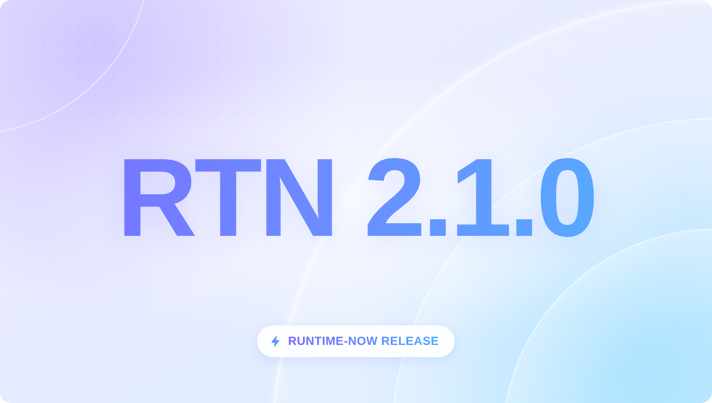
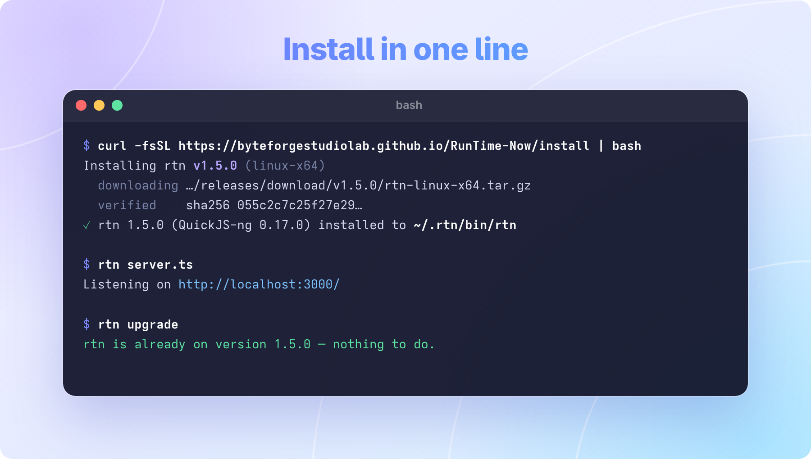
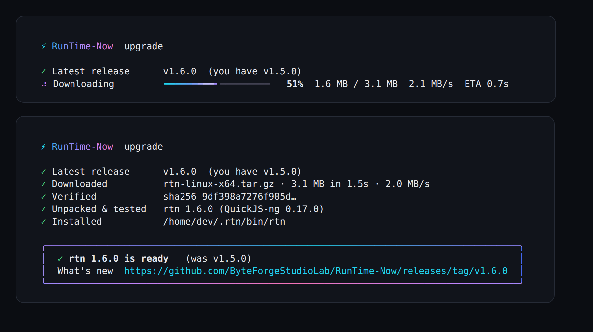
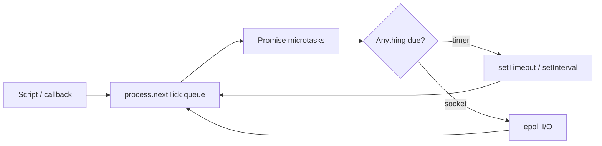
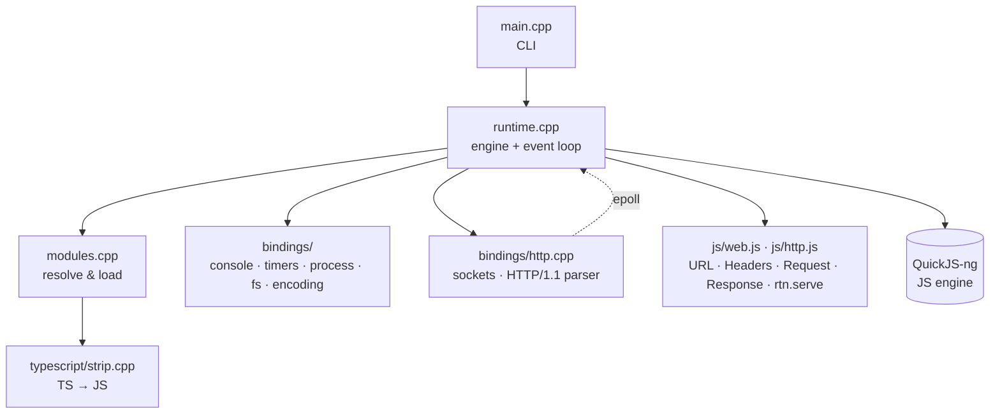

<div align="center">



# ⚡ RunTime-Now

**A small, fast JavaScript & TypeScript runtime written in C++**

Run `.js` and `.ts` files, build HTTP servers and clients with Web-standard `fetch` / `Request` / `Response`,
use npm packages, run other programs and write tests — all from a single **~3 MB** binary that starts in **~6 ms**.

[](LICENSE)


🇬🇧 **English** · 🇺🇿 [O'zbekcha](README.uz.md)

</div>

```ts
// server.ts
rtn.serve({ port: 3000 }, (req: Request) => {
  const url = new URL(req.url);
  return Response.json({ hello: url.searchParams.get("name") ?? "world" });
});
```

```sh
$ rtn server.ts
Listening on http://localhost:3000/
```

**Install** (Linux x64 / arm64):

```sh
curl -fsSL https://byteforgestudiolab.github.io/RunTime-Now/install | bash
```

---

## Table of contents

- [Why RunTime-Now?](#why-runtime-now)
- [Features](#features)
- [Installation](#installation)
- [Build from source](#build-from-source)
- [Command line](#command-line)
- [Project workflow: scripts, watch mode, `.env`](#project-workflow-scripts-watch-mode-env)
- [Examples](#examples)
- [API reference](#api-reference)
  - [Globals at a glance](#globals-at-a-glance)
  - [console](#console)
  - [Timers & microtasks](#timers--microtasks)
  - [process](#process)
  - [Modules](#modules)
  - [npm packages and CommonJS](#npm-packages-and-commonjs)
  - [Node built-in modules](#node-built-in-modules)
  - [Child processes: `node:child_process`](#child-processes-nodechild_process)
  - [Testing your code: `rtn test`](#testing-your-code-rtn-test)
  - [File system: `rtn:fs`](#file-system-rtnfs)
  - [HTTP server: `rtn.serve()`](#http-server-rtnserve)
  - [Web APIs](#web-apis)
  - [fetch()](#fetch)
  - [Events and cancellation](#events-and-cancellation)
  - [crypto and structuredClone](#crypto-and-structuredclone)
  - [`node:path` and `node:fs/promises`](#nodepath-and-nodefspromises)
- [TypeScript](#typescript)
- [Architecture](#architecture)
- [Performance](#performance)
- [Testing](#testing)
- [Limitations & roadmap](#limitations--roadmap)
- [Contributing](#contributing) · [License](#license) · [Acknowledgements](#acknowledgements)

---

## Why RunTime-Now?

Node.js, Deno and Bun are big, sophisticated projects. RunTime-Now (`rtn`) is a runtime you can
**read in a weekend** (about 12,000 lines of C++ and JavaScript) that still does real work:

- 🧩 **Learn how a runtime works.** The event loop, module loader, HTTP parser and TypeScript
  stripper are small, commented and tested.
- 🪶 **Tiny footprint.** A single ~3 MB binary with no dependencies (fully static), ~6 ms startup and ~3 MB RSS for an HTTP server.
- 🟦 **TypeScript out of the box.** No `tsc`, no bundler, no config. The built-in stripper keeps
  line and column numbers, so stack traces point at your `.ts` source.
- 🌐 **Web-standard APIs.** `fetch`-style `Request` / `Response` / `Headers` / `URL`, the same code
  shape as Deno and Bun.

## Features

| Area | What you get |
|---|---|
| **Language** | ES2024+ via [QuickJS-ng](https://github.com/quickjs-ng/quickjs): classes with `#private` fields, `async`/`await`, **top-level `await`**, BigInt, Proxy, `Array.prototype.toSorted`, `Object.groupBy`, `Promise.withResolvers`, … |
| **TypeScript** | Runs `.ts` / `.mts` directly. Supports types, interfaces, generics, `enum`, `const enum`, parameter properties, overloads, `abstract`, `declare`, `satisfies`, `as const`, and import elision |
| **npm & CommonJS** | Packages from `node_modules` (`exports`, `imports`, `main`, conditions), `require()`, `module.exports`, ESM ⇄ CommonJS interop. Tested with lodash, zod, dayjs, chalk, date-fns, uuid, yaml, semver, … |
| **Modules** | ES modules, relative imports with extension resolution, JSON imports, `import "./x.js"` → `x.ts`, dynamic `import()`, `import.meta` |
| **Event loop** | Microtasks → `process.nextTick` → timers → **epoll** I/O, with Node-compatible ordering |
| **HTTP server** | `rtn.serve()`: HTTP/1.1, keep-alive, pipelining, chunked bodies, `Expect: 100-continue`, idle and request timeouts, size limits |
| **HTTP client** | **`fetch()`** with redirects, `AbortSignal` timeouts, `data:` URLs and Node-style errors |
| **Web APIs** | `URL`, `URLSearchParams`, `Headers`, `Request`, `Response`, `TextEncoder`, `TextDecoder`, `EventTarget`, `AbortController`, `crypto.randomUUID()`, `structuredClone()`, `atob`/`btoa`, `performance.now()` |
| **Node-style APIs** | `console` (incl. `table`, `group`, `count`, `trace`, `time`), `process` (an `EventEmitter`), `Buffer`, `node:fs`, `fs/promises` (non-blocking), `path`, `events`, `util`, `os`, `assert`, `url`, `crypto` (hashes, HMAC), **`child_process`**, `module`, `timers`, `tty` |
| **Testing** | `rtn test`: built-in test runner with the Jest/Bun API (`describe`, `test`, `expect`, mocks, hooks) |
| **Developer experience** | `rtn run` for package.json scripts, `rtn --watch` (restart on save), automatic `.env` loading, `rtn init` for a new TypeScript or JavaScript project, Animated `rtn upgrade` with a live progress bar, REPL with top-level `await` and TS syntax, `rtn strip` to see the JS generated from TS, Node-style error output with `cause` and error codes |

## Installation

```sh
curl -fsSL https://byteforgestudiolab.github.io/RunTime-Now/install | bash
```

<p align="center"></p>

The installer downloads the release for your CPU (x64 or arm64), **verifies its SHA-256 checksum**,
puts `rtn` in `~/.rtn/bin` and adds it to your `PATH` (bash, zsh or fish). Open a new terminal, then:

```sh
rtn --version
rtn examples/server.ts
```

Release binaries are **statically linked**, so they run on any Linux distribution (Ubuntu, Debian,
Fedora, Arch, Alpine, …) with nothing else installed.

| Task | Command |
|---|---|
| Install a specific version | `curl -fsSL …/install \| bash -s v1.5.0` |
| Install somewhere else | `curl -fsSL …/install \| RTN_INSTALL=/opt/rtn bash` |
| **Upgrade to the latest release** | `rtn upgrade` (or `rtn update -r`) |
| Check for a new version | `rtn upgrade --check` |
| Switch to a specific version | `rtn upgrade --version 1.5.0` |
| Uninstall | `rm -rf ~/.rtn` and remove the `# rtn` lines from `~/.bashrc` / `~/.zshrc` |

The short URL is served by GitHub Pages; the same script is also at
`https://raw.githubusercontent.com/ByteForgeStudioLab/RunTime-Now/main/install.sh`.

`rtn upgrade` works like `bun upgrade`: it downloads the new release, checks its SHA-256 against the
published `SHA256SUMS`, makes sure the new binary runs, and only then swaps it in atomically. If
anything fails (or you press Ctrl+C), your current `rtn` stays untouched. In a terminal every step is
animated in a calm black/white/blue style: a smooth progress bar with speed and ETA, a checkmark per step and a summary box.

<p align="center"></p>

## Build from source

### Requirements

- Linux (tested on x86-64)
- CMake ≥ 3.20 and a C++20 compiler (GCC ≥ 13 or Clang ≥ 18; both are tested in CI)
- [Ninja](https://ninja-build.org/) (optional, but faster builds)
- `git` (QuickJS-ng is a git submodule)

### Build

```sh
git clone --recursive https://github.com/ByteForgeStudioLab/RunTime-Now.git
cd RunTime-Now
cmake -S . -B build -G Ninja -DCMAKE_BUILD_TYPE=Release
cmake --build build
./build/rtn --version
```

> Already cloned without `--recursive`? Run `git submodule update --init`.
>
> **Tip:** GCC 16 currently generates a much slower interpreter loop for QuickJS (about 2.5× on
> CPU-heavy code). If your distribution ships GCC 16, build with Clang:
> `CC=clang CXX=clang++ cmake -S . -B build -G Ninja -DCMAKE_BUILD_TYPE=Release`.
> Release binaries are built with GCC 13 and are not affected.

### Run something

```sh
./build/rtn examples/hello.js
./build/rtn examples/ts/main.ts
./build/rtn examples/server.ts        # then open http://localhost:3000
```

### Put your build on the `PATH` (optional)

```sh
./install.sh --binary build/rtn   # copies it to ~/.rtn/bin and updates your shell config
```

## Command line

| Command | Description |
|---|---|
| `rtn <file> [args...]` | Run a `.js`, `.mjs`, `.cjs`, `.ts`, `.mts` or `.cts` file (`process.argv` gets the args) |
| `rtn run <file> [args...]` | Same as above |
| `rtn run <script> [args...]` | Run a `package.json` script ([details](#project-workflow-scripts-watch-mode-env)); `rtn run` alone lists them |
| `rtn --watch <file \| command>` | Restart when a source file changes: `rtn --watch app.ts`, `rtn --watch test` |
| `rtn --env-file <file> …` | Load this `.env` file instead of `.env.local` / `.env.$NODE_ENV` / `.env` (`--no-env-file`: none) |
| `rtn -e "<code>" [args...]` | Evaluate code as an ES module |
| `rtn test [paths] [-t name]` | Run the tests in `*.test.*`, `*_test.*`, `*.spec.*` files ([rtn test](#testing-your-code-rtn-test)) |
| `rtn init [dir]` | Create a project — asks **TypeScript** or **JavaScript** (↑/↓, Enter): `package.json`, `index.ts` / `index.js`, a test, `tsconfig.json` / `jsconfig.json`. Skip the question with `--ts` or `--js`; without a terminal (scripts, CI) it picks TypeScript |
| `rtn strip <file.ts>` | Print the JavaScript produced from a TypeScript file |
| `rtn upgrade` / `rtn update -r` | Upgrade to the latest release (`--check`, `--version x.y.z`, `--force`) |
| `rtn` | Start the REPL (on a terminal) or run a script piped into stdin |
| `rtn -i` | Force the REPL even when stdin is piped |
| `rtn -` | Run a script read from stdin |
| `rtn -h`, `rtn -v` | Help / version |

**Exit codes:** `0` success · `1` uncaught error or unhandled rejection · `13` top-level `await` that never settles (like Node) · anything set with `process.exitCode` / `process.exit(n)`.

**REPL:**

```text
$ rtn
RunTime-Now v2.1.0 (QuickJS-ng 0.17.0)
Type .help for help, .exit or Ctrl+D to quit.
> const res = await new Promise((r) => setTimeout(() => r("done"), 100))
> res
'done'
> function add(a: number, b: number): number { return a + b }
> add(2, 3)
5
```

## Project workflow: scripts, watch mode, `.env`

**`rtn run`** runs the `"scripts"` of the nearest `package.json`, like `npm run` / `bun run`:

```json
{
  "scripts": {
    "dev": "rtn --watch src/server.ts",
    "test": "rtn test",
    "pretest": "echo checking…"
  }
}
```

```text
$ rtn run test -t parser
$ echo checking…
checking…
$ rtn test -t parser
…
```

The script runs in `/bin/sh` from the package's directory, with `node_modules/.bin` (of the package and
every directory above it) and rtn itself first on `PATH`. `pre<name>` / `post<name>` run around it,
extra arguments are passed on, and `npm_package_name`, `npm_package_version`, `npm_lifecycle_event`
are set. The exit code is the script's. `rtn run` with no name lists the scripts.

**`rtn --watch`** restarts your program when a `.js`, `.ts`, `.json` or `.env` file changes:

```text
$ rtn --watch server.ts
● rtn --watch server.ts · 3 directories
Listening on http://localhost:3000/
● rtn --watch restarting · src/routes.ts changed
Listening on http://localhost:3000/
```

It watches the current directory tree with inotify (skipping `node_modules` and hidden directories),
waits for a short quiet period so an editor's save counts once, and works with any command:
`rtn --watch test`, `rtn --watch run dev`. Ctrl+C stops everything.

**`.env` files** are loaded into `process.env` before your code runs, from the current directory:

| File | Loaded |
|---|---|
| `.env.local` | Always, except when `NODE_ENV=test` |
| `.env.$NODE_ENV` | When `NODE_ENV` is set, e.g. `.env.production` |
| `.env` | Always |

```sh
# .env
DATABASE_URL="postgres://localhost/dev"   # comments are fine
API_URL=${HOST:-http://localhost}:8080    # ${VAR} and ${VAR:-default} expand
export DEBUG=1
PRIVATE_KEY="-----BEGIN KEY-----
multi-line values work in double quotes
-----END KEY-----"
```

Variables that are already set in the environment win, then the files in the order above. Child
processes and `rtn run` scripts see the values too. `--env-file path` (repeatable, later files win)
loads only the files you name; `--no-env-file` turns loading off. Both go before the file or command:
`rtn --env-file .env.staging server.ts`.

## Examples

<details open>
<summary><b>TypeScript with classes, enums and generics</b></summary>

```ts
enum Role { Admin, User }

interface Person { name: string; role: Role }

class Team<T extends Person> {
  #members: T[] = [];
  constructor(public readonly name: string) {}
  add(member: T): this { this.#members.push(member); return this; }
  get size(): number { return this.#members.length; }
}

const team = new Team<Person>("core").add({ name: "Ali", role: Role.Admin });
console.log(team.name, team.size, Role[Role.Admin]);   // core 1 Admin
```
</details>

<details>
<summary><b>A JSON REST API</b></summary>

```ts
interface Todo { id: number; title: string; done: boolean }
const todos: Todo[] = [];

rtn.serve({ port: 3000 }, async (req) => {
  const { pathname } = new URL(req.url);

  if (pathname === "/todos" && req.method === "GET") return Response.json(todos);

  if (pathname === "/todos" && req.method === "POST") {
    const { title } = (await req.json()) as Partial<Todo>;
    if (!title) return Response.json({ error: "title is required" }, { status: 400 });
    const todo = { id: todos.length + 1, title, done: false };
    todos.push(todo);
    return Response.json(todo, { status: 201 });
  }

  return new Response("Not found", { status: 404 });
});
```

```sh
curl -X POST localhost:3000/todos -d '{"title":"write docs"}'
curl localhost:3000/todos
```
</details>

<details>
<summary><b>Files, timers and top-level await</b></summary>

```js
import { readFileSync, writeFileSync, existsSync } from "rtn:fs";

const sleep = (ms) => new Promise((r) => setTimeout(r, ms));

writeFileSync("notes.txt", "first line\n");
await sleep(100);
console.log(readFileSync("notes.txt", "utf8"), existsSync("notes.txt"));

try {
  readFileSync("missing.txt");
} catch (err) {
  console.log(err.code);   // ENOENT
}
```
</details>

More in [`examples/`](examples): `server.ts`, `ts/main.ts`, `ts/edge.ts` (100+ TypeScript edge cases), `web-apis.js`, `event-loop.js`.

## API reference

### Globals at a glance

| Global | Notes |
|---|---|
| `console` | Node-style formatting and colors, see [below](#console) |
| `setTimeout`, `setInterval`, `clearTimeout`, `clearInterval` | Extra arguments are passed to the callback |
| `queueMicrotask(fn)` | Runs `fn` as a microtask |
| `process` | See [process](#process) |
| `rtn` | `rtn.version`, `rtn.serve()` |
| `fetch` | HTTP client, see [fetch()](#fetch) |
| `EventTarget`, `Event`, `CustomEvent`, `AbortController`, `AbortSignal` | See [Events and cancellation](#events-and-cancellation) |
| `crypto`, `structuredClone` | See [crypto and structuredClone](#crypto-and-structuredclone) |
| `navigator` | `userAgent`, `hardwareConcurrency`, `platform`, `language` |
| `URL`, `URLSearchParams`, `Headers`, `Request`, `Response` | See [Web APIs](#web-apis) |
| `TextEncoder`, `TextDecoder` | UTF-8 |
| `atob`, `btoa`, `performance.now()` | Built into QuickJS-ng |

### console

| Method | Behaviour |
|---|---|
| `log`, `info`, `debug` | stdout |
| `error`, `warn` | stderr |
| `dir(obj)` | Inspect a single value |
| `table(data, columns?)` | Box-drawn table of an array or object |
| `group(...label)`, `groupCollapsed`, `groupEnd` | Indent the following output |
| `count(label?)`, `countReset(label?)` | `label: N` |
| `time(label?)`, `timeLog(label?, ...data)`, `timeEnd(label?)` | `label: 1.234ms` |
| `assert(cond, ...data)` | Prints `Assertion failed: …` when `cond` is falsy |
| `trace(...data)` | Message + current stack trace on stderr |

Format specifiers: `%s %d %i %f %j %o %O %c %%`. Output matches Node's inspector style
(`Map(1) { 'a' => 1 }`, `[class A extends B]`, `<ref *1> { self: [Circular *1] }`, `-0`, …),
and objects such as `URL` or `Response` print their fields.

### Timers & microtasks

Execution order is the same as in Node for ES modules:



The process exits when there are no pending timers, open servers or microtasks left.

### process

| Property / method | Description |
|---|---|
| `argv` | `[execPath, scriptPath, ...args]`, absolute paths like Node |
| `env` | Environment variables (object) |
| `exit(code?)`, `exitCode` | Exit now / set the code used on normal exit |
| `cwd()`, `chdir(dir)` | Working directory |
| `nextTick(fn, ...args)` | Runs before promise callbacks |
| `hrtime([prev])`, `hrtime.bigint()` | High-resolution time |
| `memoryUsage()` | `{ rss, heapTotal, heapUsed, external, arrayBuffers }` |
| `uptime()` | Seconds since start |
| `stdout.write(data)`, `stderr.write(data)` | Write a string or `Uint8Array` (no newline) |
| `stdout.isTTY`, `stderr.isTTY` | Terminal detection |
| `platform`, `arch`, `pid`, `ppid`, `execPath`, `version`, `versions`, `title` | Process info |

### Modules

```ts
import { helper } from "./utils.ts";     // relative import
import { helper } from "./utils";        // tries .js .mjs .ts .mts .json, then index.js / index.ts
import { helper } from "./utils.js";     // falls back to utils.ts (TypeScript ESM convention)
import data from "./data.json";          // JSON (default export)
import fs from "node:fs";                // built-in module (also "fs", "rtn:fs")
import _ from "lodash";                  // npm package from node_modules
const mod = await import("./lazy.js");   // dynamic import

import.meta.url;        // "file:///abs/path/file.ts"
import.meta.filename;   // "/abs/path/file.ts"
import.meta.dirname;    // "/abs/path"
import.meta.main;       // true for the entry module
```

### npm packages and CommonJS

Install packages with any package manager (`npm install`, `pnpm`, `bun install`, …) and use them:

```ts
import { z } from "zod";                          // ES module package
import _ from "lodash";                           // CommonJS package: module.exports is the default export
import { chunk } from "lodash";                   // ...and its properties are named exports
const dayjs = require("dayjs");                   // in a .cjs file (or any CommonJS file)
```

| | How it works |
|---|---|
| Resolution | `node_modules` up the directory tree, `package.json` `"exports"` (subpaths, `*` patterns, conditions `rtn` → `node` → `import`/`require` → `default`), `"imports"` (`#internal`), `"main"`, index files, `NODE_PATH` |
| CommonJS | `require()`, `module.exports`, `exports`, `__filename`, `__dirname`, `require.resolve`, `require.cache`, `require.main`, `createRequire(import.meta.url)` |
| Which files are CommonJS? | `.cjs`; `.js`/`.ts` when the nearest `package.json` says `"type": "commonjs"`; without `"type"`, files that use `require`/`module.exports` and no `import`/`export` (like Node 22) |
| Interop | `import` of a CommonJS file gives `module.exports` as the default export and its properties as named exports; `require()` of an ES module works when it has no top-level `await` |
| TypeScript | `.ts`, `.mts`, `.cts` files work everywhere, also inside `node_modules` |

Not yet: native addons (`.node`), `node:stream`, `node:http` (use `rtn.serve()` and `fetch()`).

### Node built-in modules

Every module works as `node:x` and `x`; `import fs from "fs"` and `require("fs")` give the same object.

| Module | What's there |
|---|---|
| `fs`, `fs/promises` | Sync API (`readFileSync`, `writeFileSync`, `statSync`, `mkdirSync`, `rmSync`, …) and promises (run on a thread pool) |
| `path` | The POSIX implementation from Node (output checked against Node) |
| `events` | `EventEmitter` (`on`, `once`, `off`, `emit`, `prependListener`, …), `once()`, `on()` |
| `buffer` | `Buffer` (also global): utf8, hex, base64, base64url, latin1, ascii, utf16le; `read/writeUInt32LE` & co. |
| `util` | `format`, `inspect`, `promisify`, `callbackify`, `inherits`, `deprecate`, `isDeepStrictEqual`, `types`, `styleText` |
| `assert`, `assert/strict` | `ok`, `equal`, `strictEqual`, `deepStrictEqual`, `throws`, `rejects`, `match`, … |
| `crypto` | `createHash` / `createHmac` (sha256, sha1, md5), `randomBytes`, `randomInt`, `randomUUID`, `timingSafeEqual`; global `crypto.subtle.digest` |
| `child_process` | `spawn`, `exec`, `execFile`, `spawnSync`, `execSync`, `execFileSync` ([below](#child-processes-nodechild_process)) |
| `os`, `url`, `module`, `timers`, `timers/promises`, `process`, `tty` | The commonly used functions (`os.cpus()`, `fileURLToPath`, `createRequire`, `setTimeout` promise, …) |

`process` is an `EventEmitter` (`process.on("exit")`), and `global`, `setImmediate`, `process.emitWarning` exist.
**Note (2.0):** `process.version` reports the Node version whose APIs rtn follows (`v22.12.0`), so packages
pick their Node code paths; rtn's own version is `process.versions.rtn` / `rtn.version`.

### Child processes: `node:child_process`

```ts
import { spawn, exec, execSync } from "node:child_process";
import { promisify } from "node:util";

const branch = execSync("git branch --show-current", { encoding: "utf8" }).trim();

const { stdout } = await promisify(exec)("ls -1 src | wc -l");
console.log(`${stdout.trim()} files on ${branch}`);

const child = spawn("grep", ["-c", "TODO"], { cwd: "src" });
child.stdout.setEncoding("utf8").on("data", (n) => console.log("TODOs:", n.trim()));
child.on("close", (code) => console.log("grep exited with", code));
child.stdin.end("TODO: one\nTODO: two\n");
```

| | |
|---|---|
| Functions | `spawn`, `exec`, `execFile` (callback, or `util.promisify` → `{ stdout, stderr }`), `spawnSync`, `execSync`, `execFileSync` |
| Options | `cwd`, `env`, `stdio` (`"pipe"`, `"inherit"`, `"ignore"`, per fd), `shell`, `input`, `encoding`, `timeout`, `killSignal`, `maxBuffer`, `signal` (AbortSignal), `argv0` |
| `ChildProcess` | `pid`, `stdin` / `stdout` / `stderr` (`data`, `end`, `setEncoding`, `pipe()`, `for await`), `kill()`, `exitCode`, `signalCode`; events `spawn`, `exit`, `close`, `error` |
| Errors | As in Node: `spawn foo ENOENT` (`code`, `errno`, `syscall`, `path`, `spawnargs`), `Command failed: …` with `status` / `code`, `signal`, `stdout`, `stderr` |

`tests/cases/child-process.mjs` prints exactly what Node 22 prints. Not supported: `fork()` and IPC
(`send()`), `detached` process groups and `stdio` entries other than the three above.

### Testing your code: `rtn test`

```ts
// math.test.ts
import { describe, test, expect, mock } from "rtn:test";

describe("add", () => {
  test("adds numbers", () => {
    expect(1 + 2).toBe(3);
    expect({ a: [1, 2] }).toEqual({ a: [1, 2] });
  });

  test("works with async code", async () => {
    await expect(Promise.resolve(42)).resolves.toBe(42);
  });

  test.each([[1, 1, 2], [2, 3, 5]])("%i + %i = %i", (a, b, sum) => {
    expect(a + b).toBe(sum);
  });
});

test("mocks", () => {
  const fn = mock((x: number) => x * 2);
  fn(21);
  expect(fn).toHaveBeenCalledWith(21);
});
```

```text
$ rtn test

● rtn test v2.1.0

math.test.ts:
  ✓ add › adds numbers [0.09ms]
  ✓ add › works with async code [0.12ms]
  ✓ add › 1 + 1 = 2 [0.05ms]
  ✓ add › 2 + 3 = 5 [0.04ms]
  ✓ mocks [0.10ms]

 5 pass
 Ran 5 tests across 1 file. [3.1ms]
```

| | |
|---|---|
| Files | `*.test.*`, `*_test.*`, `*.spec.*` (`.js .ts .mjs .mts .cjs .cts`), `node_modules` skipped; `rtn test src/` or `rtn test math` to narrow down, `-t <regex>` to filter by test name |
| Structure | `test` / `it`, `describe`, `.skip`, `.only`, `.todo`, `.each`, `.if`, `beforeAll`, `afterAll`, `beforeEach`, `afterEach`, `done` callbacks, timeouts (`--timeout`, per test, `setDefaultTimeout`) |
| `expect` | `toBe`, `toEqual`, `toStrictEqual`, `toMatchObject`, `toContain`, `toHaveLength`, `toHaveProperty`, `toMatch`, `toThrow`, `toBeCloseTo`, `toBeInstanceOf`, comparisons, `toHaveBeenCalled*`, `.not`, `.resolves`, `.rejects`, `expect.any()` and friends |
| Mocks | `mock(fn)` / `fn()` (`mockReturnValue`, `mockResolvedValue`, `mockImplementation`, …), `spyOn(object, method)` |

Exit code `1` when a test fails, so it fits CI.

### File system: `rtn:fs`

A synchronous API modelled on Node's `fs`, importable as `rtn:fs` or `node:fs` (default or named exports).

| Function | Description |
|---|---|
| `readFileSync(path, encoding?)` | `Uint8Array`, or a string when an encoding (`"utf8"` / `{ encoding }`) is given |
| `writeFileSync(path, data)` / `appendFileSync(path, data)` | `data`: string or `Uint8Array` |
| `existsSync(path)` | `boolean` |
| `readdirSync(path)` | Sorted array of names |
| `mkdirSync(path, { recursive? })` | With `recursive`, returns the first directory created |
| `rmSync(path, { recursive?, force? })` | Files and directories |
| `renameSync(from, to)`, `copyFileSync(from, to)` | |
| `statSync(path)`, `lstatSync(path)` | `{ size, mode, uid, gid, atime, mtime, ctime, *Ms }` + `isFile()`, `isDirectory()`, `isSymbolicLink()` |

Errors carry Node's fields, so existing error handling keeps working:

```js
try { fs.readFileSync("/nope"); }
catch (e) { e.code; e.errno; e.syscall; e.path; }   // 'ENOENT', -2, 'open', '/nope'
```

### HTTP server: `rtn.serve()`

```ts
rtn.serve(options?, handler)
rtn.serve(handler)
rtn.serve({ port, fetch: handler })   // Bun-style
```

`handler(request: Request, info) => Response | Promise<Response>`, where `info.remoteAddr` is `{ transport, hostname, port }`.

| Option | Default | Description |
|---|---|---|
| `port` | `3000` | `0` picks a free port |
| `hostname` | `"0.0.0.0"` | Use `"127.0.0.1"` to accept local connections only |
| `onListen({ hostname, port })` | logs `Listening on …` | Pass `false` to stay silent |
| `onError(error)` | logs + `500` | May return a `Response` |
| `keepAliveTimeout` | `5000` ms | Idle keep-alive connections are closed after this |
| `requestTimeout` | `60000` ms | A request must fully arrive in this time (`408` otherwise) |

The returned server object has `{ hostname, port, url, stop(), shutdown(), finished }`.
`stop()` stops accepting connections; requests already in progress still get their response.

**Protocol details:** HTTP/1.0 and 1.1, keep-alive, pipelining, chunked request bodies,
`Expect: 100-continue`, `HEAD`, automatic `content-length` and `date`.
**Protection:** 400 for malformed requests, 431 for headers over 64 KB, 413 for bodies over 64 MB,
400 for conflicting `Content-Length` (request smuggling), 505 for unknown HTTP versions,
408 for slow requests (slowloris), and survives running out of file descriptors.

### Web APIs

| API | Supported |
|---|---|
| `URL` | Parsing, relative resolution, all getters/setters, `searchParams`, `URL.canParse`, `URL.parse` |
| `URLSearchParams` | All methods incl. `sort`, `size`, iteration; linked to `url.searchParams` |
| `Headers` | Case-insensitive, `getSetCookie()`, iteration (sorted), validation |
| `Request` | `method`, `url`, `headers`, `text()`, `json()`, `bytes()`, `arrayBuffer()`, `clone()` |
| `Response` | Constructor, `Response.json()`, `Response.redirect()`, `Response.error()`, body methods, `clone()` |
| `TextEncoder` / `TextDecoder` | UTF-8, `encodeInto`, `fatal`, `ignoreBOM`, U+FFFD replacement |

Body values can be a `string`, `Uint8Array` or any `ArrayBufferView`, an `ArrayBuffer`,
`URLSearchParams`, or `null`. Streams (`ReadableStream`) and `formData()` are not implemented yet.

### fetch()

```ts
const res = await fetch("http://localhost:3000/todos", {
  method: "POST",
  headers: { "content-type": "application/json" },
  body: JSON.stringify({ title: "write docs" }),
  signal: AbortSignal.timeout(5000),     // optional: give up after 5 s
});
console.log(res.status, res.redirected, await res.json());
```

| Feature | Details |
|---|---|
| URLs | `http:` and `data:`. `https:` is not supported yet (no TLS); it fails with `cause.code === "ERR_TLS_NOT_SUPPORTED"` |
| Redirects | `redirect: "follow"` (default, max 20), `"error"`, `"manual"`; 303 → GET; credentials dropped across origins |
| Cancel | `signal` (`AbortController`, `AbortSignal.timeout()`, `AbortSignal.any()`) |
| Bodies | string, bytes, `URLSearchParams`; responses with `Content-Length`, chunked or until close |
| Errors | Like Node: `TypeError: fetch failed` with the reason in `cause`, e.g. `connect ECONNREFUSED 127.0.0.1:1` (`code`, `syscall`, `address`, `port`) or `getaddrinfo ENOTFOUND host` |

DNS lookups run on a small thread pool, so they never block the event loop. Each request uses its own
connection (`connection: close`).

### Events and cancellation

`EventTarget`, `Event`, `CustomEvent` (listeners with `once`, `passive`, `signal`, `handleEvent` objects),
`AbortController` and `AbortSignal` (`abort()`, `timeout()`, `any()`, `throwIfAborted()`, `onabort`).
A pending `AbortSignal.timeout()` doesn't keep the process alive, just like in Node.

### crypto and structuredClone

```js
crypto.randomUUID();                          // "3b241101-e2bb-4255-8caf-4136c566a962"
crypto.getRandomValues(new Uint8Array(16));   // from the kernel's CSPRNG (getrandom)
const copy = structuredClone({ when: new Date(), tags: new Set(["a"]), self: null });
```

`structuredClone` handles primitives, `Date`, `RegExp`, `Map`, `Set`, `ArrayBuffer` (with `transfer`), typed arrays,
`DataView`, errors, arrays, plain objects and cycles; functions, symbols and platform objects throw `DataCloneError`.

### `node:path` and `node:fs/promises`

```js
import path from "node:path";            // also "path", "rtn:path"
import fs from "node:fs/promises";       // also "fs/promises", (await import("fs")).promises

const file = path.join(import.meta.dirname, "data", "notes.txt");
await fs.mkdir(path.dirname(file), { recursive: true });
await fs.writeFile(file, "hello");
console.log(await fs.readFile(file, "utf8"), path.extname(file));   // hello .txt
```

`path` is the POSIX implementation from Node (`join`, `resolve`, `relative`, `normalize`, `dirname`, `basename`,
`extname`, `parse`, `format`, `isAbsolute`, `sep`, `delimiter`); the tests check its output against Node.
`fs/promises` has `readFile`, `writeFile`, `appendFile`, `readdir`, `mkdir`, `rm`, `rmdir`, `unlink`, `rename`,
`copyFile`, `stat`, `lstat`, `access`, `realpath` and `constants`, and runs the work on the thread pool.

## TypeScript

`rtn` runs TypeScript by **erasing types**, the way Node (`--experimental-strip-types`), Deno and Bun
do. It does **not** type-check; use `tsc --noEmit` in your editor or CI for that.

Types are replaced with spaces, so line and column numbers stay exactly the same:

```ts
function add(a: number, b: number): number { return a + b; }
```

```js
function add(a        , b        )         { return a + b; }
```

`rtn strip file.ts` prints this output so you can see what runs.

| Supported | How |
|---|---|
| Annotations, `interface`, `type`, generics, `as`, `satisfies`, `!`, `?`, `declare`, overloads, `abstract`, access modifiers, `implements`, `this` parameters, type-only namespaces | Erased |
| `enum`, `const enum` | Compiled to a JS object (with reverse mapping for numbers) |
| `constructor(private x: number)` | Compiled to a field plus `this.x = x` |
| `import type`, `import { type X }`, imports used only as types | Removed, like `tsc` |

| Not supported (yet) | You get |
|---|---|
| Namespaces that contain runtime code, `import x = require()`, `export =` | A clear error with file:line:col |
| Decorators (`@decorator`) | A clear error |
| `.tsx` / JSX | A clear error |

**How well does it work?** The stripper was run against **834 real `.ts` files** from popular packages
(zod, ajv, web-vitals, …): 823 produced valid JavaScript, and **791 were character-for-character
identical** to Node's own type stripper (the rest use namespaces or decorators).

## Architecture



- **C++** does what needs speed or the OS: the event loop (epoll), sockets, the HTTP parser, the
  TypeScript stripper, UTF-8 and file I/O.
- **JavaScript** (embedded into the binary at build time) implements the Web APIs on top of a few
  native functions, which is also how Node, Deno and Bun are built.

```
src/
├── main.cpp              CLI
├── dotenv.cpp/.hpp       .env parsing and loading
├── watch.cpp/.hpp        rtn --watch: inotify, restarts
├── runtime.cpp/.hpp      JS engine, event loop, timers, I/O, unhandled rejections
├── repl.cpp              REPL (async eval, multi-line input, TypeScript)
├── upgrade.cpp           rtn upgrade: download, verify SHA-256, atomic replace
├── term.cpp/.hpp         Terminal UI for rtn upgrade: colors, spinner, progress bar
├── modules.cpp/.hpp      Module resolution and loading
├── builtins.cpp          Runs the embedded JS (compiled to bytecode at build time) at startup
├── util.cpp/.hpp         Helpers, Node-style errors
├── typescript/strip.cpp  TypeScript → JavaScript (tokenizer + type eraser)
├── js/events.js          EventTarget, Event, AbortController, AbortSignal
├── js/web.js             URL, URLSearchParams, Headers, Request, Response, TextEncoder/Decoder
├── js/fetch.js           fetch()
├── js/crypto.js          crypto, structuredClone
├── js/modules.js         node:fs, node:path, node:fs/promises
├── js/buffer.js          Buffer
├── js/node.js            node:events, util, os, assert, url, crypto, timers, process
├── js/cjs.js             npm package resolution, CommonJS require()
├── js/child_process.js   node:child_process
├── js/test.js, init.js   rtn test, rtn init
├── js/scripts.js         rtn run <script>
├── js/http.js            rtn.serve()
└── bindings/             console, timers, process, fs, encoding, http, fetch, crypto, child_process
tests/                    Test suite (run.sh, cases/, strip/, http_test.py, fetch_test.py, upgrade_test.sh)
install.sh                One-line installer (curl … | bash)
.github/workflows/        CI (every push) and release (a version bump on main, or a v* tag)
tools/embed_js.cpp        Build step: compiles src/js/*.js to QuickJS bytecode
tools/loadgen.cpp         HTTP/1.1 load generator used for the benchmarks
third_party/quickjs/      QuickJS-ng (git submodule)
```

## Performance

"Hello World" HTTP server, HTTP/1.1 keep-alive, 64 connections, 4 client threads, 5 seconds,
measured with [`tools/loadgen`](tools/loadgen.cpp) on the same machine:

| Runtime | Requests/s | p99 latency | Memory (RSS) | Startup |
|---|---:|---:|---:|---:|
| **rtn 1.5** (release binary) | **51,751** | 3.20 ms | **3.2 MB** | 10 ms |
| Node 24 | 55,466 | 2.84 ms | 89.0 MB | 44 ms |
| Bun 1.4 | 99,590 | 1.64 ms | 38.8 MB | 2 ms |
| Deno 2.9 | 113,984 | 1.24 ms | 43.6 MB | 29 ms |

- **rtn is within ~10% of Node's throughput** while using **28× less memory**. (A Clang build from
  source reaches ~59,000 req/s; the static release binary trades a little speed for running everywhere.)
- Bun and Deno are about 2× faster because their engines (JavaScriptCore, V8) have JIT compilers;
  QuickJS is an interpreter. Most of rtn's time per request is spent running JS, not in the
  C++ networking code (~9%).
- Numbers vary between machines and runs (±20%). Reproduce them yourself:

```sh
cmake --build build --target loadgen
./build/rtn examples/server.ts &
./build/loadgen 127.0.0.1 3000 / 5 64 4
```

## Testing

```sh
tests/run.sh           # everything (needs python3 for the HTTP tests)
tests/run.sh --update  # regenerate expected outputs after an intentional change
```

| Suite | What it checks |
|---|---|
| `tests/cases/` | 22 scripts with expected stdout/stderr and exit codes: console format, event loop order, modules, fs, fs/promises, path, process, errors, TypeScript, Web APIs, events, fetch, crypto, and `node-compat.mjs` (Buffer, events, util, assert, crypto, …) and `child-process.mjs`, whose output is **identical to Node 22**. Several outputs are **identical to Node or Deno** |
| `tests/strip/` | Exact TypeScript → JavaScript output, and that line numbers are preserved |
| `tests/http_test.py` | 27 HTTP checks over raw sockets: pipelining, chunked bodies, 100-continue, 400/408/413/431/505, keep-alive timeout, slowloris, 400 concurrent requests, graceful `stop()` |
| `tests/fixtures/project` | npm package resolution and CommonJS: `exports` conditions and patterns, `imports`, scoped packages, nested `node_modules`, `require` cycles, `__esModule`, `require(esm)` |
| `tests/fixtures/testrunner` | `rtn test` output (passing, failing, skipped, todo, timeouts, a broken file) and `rtn init` (TypeScript and JavaScript) |
| `tests/fixtures/scripts`, `dotenv` | `rtn run` (pre/post hooks, arguments, `node_modules/.bin`, exit codes) and `.env` parsing, file priority, `--env-file` |
| `--watch` | A real restart after an imported file changes, and that SIGTERM stops the program too |
| `tests/fetch_test.py` | 16 `fetch()` checks against a raw-socket server: chunked, close-delimited, 1xx, truncated, oversized and malformed responses |
| `tests/upgrade_test.sh` | `install.sh` and `rtn upgrade` against a fake release server: pinned and latest installs, PATH setup, tampered checksums, atomic upgrade, the animated terminal mode |
| CLI + REPL | Arguments, stdin scripts, REPL session with `await` |

CI runs the suite with GCC and Clang on every push ([`.github/workflows/ci.yml`](.github/workflows/ci.yml)).
During development the runtime was also checked with **valgrind** (0 errors, 0 leaks) and a
Debug build, in which QuickJS asserts that no JS objects leak.

## Limitations & roadmap

RunTime-Now is young. Here is what doesn't exist yet, roughly in priority order:

- [x] `fetch()` (HTTP client) — `https:` waits for TLS below
- [x] `node:path`, async `fs` (`fs/promises`)
- [x] npm packages: `node_modules`, `exports` / `imports`, bare specifiers
- [x] CommonJS `require()` and ESM ⇄ CommonJS interop
- [x] A test runner (`rtn test`)
- [x] `crypto.randomUUID()` / `getRandomValues()`, `structuredClone`, `AbortController`, `EventTarget`
- [x] `Buffer`, `crypto.subtle.digest`, `node:events` / `util` / `os` / `assert`
- [x] `node:child_process`, `rtn run` (package.json scripts), `--watch`, `.env` files
- [ ] `node:stream`, `node:http`, more of `crypto.subtle`
- [ ] Streaming bodies (`ReadableStream`), `FormData`, `Blob`
- [ ] WebSocket, HTTPS/TLS
- [ ] `Intl` (locale-aware formatting)
- [ ] TypeScript: runtime namespaces, decorators, JSX/TSX
- [ ] macOS support (kqueue instead of epoll)

## Contributing

Contributions are welcome! See [CONTRIBUTING.md](CONTRIBUTING.md) for setup, tests and code style.

## License

[MIT](LICENSE) © 2026 ByteForgeStudioLab

## Acknowledgements

- [QuickJS-ng](https://github.com/quickjs-ng/quickjs), the JavaScript engine (MIT), and Fabrice Bellard's original QuickJS.
- [Node.js](https://nodejs.org), [Deno](https://deno.com) and [Bun](https://bun.sh), whose APIs and behaviour were the reference for rtn.
