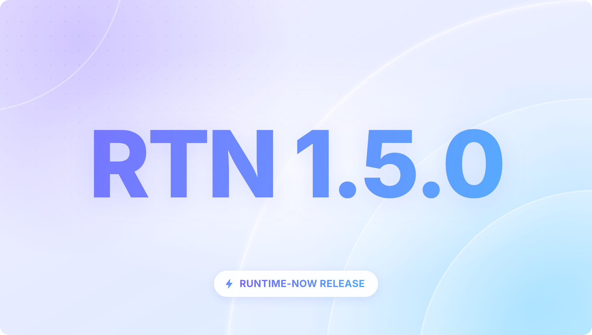
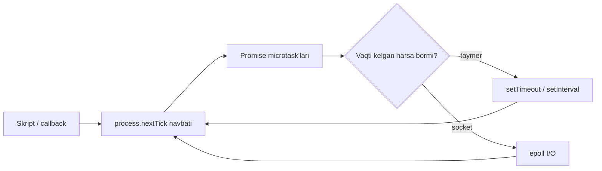
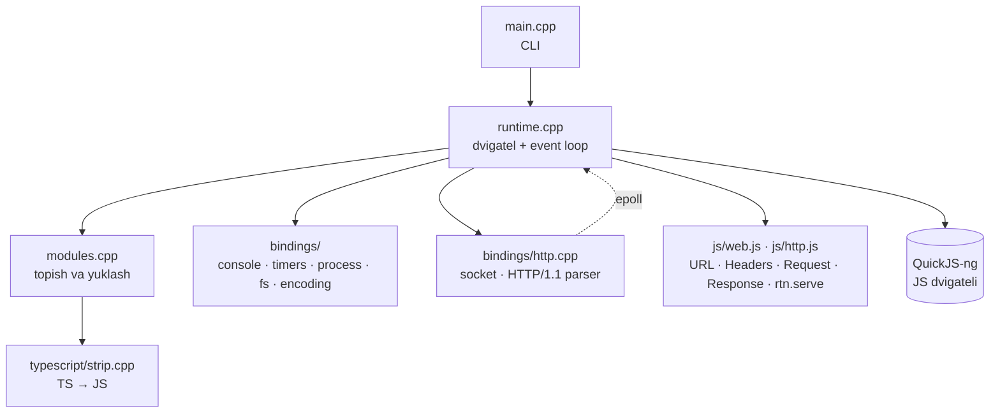

<div align="center">



# ⚡ RunTime-Now

**C++ da yozilgan kichik va tez JavaScript va TypeScript runtime**

`.js` va `.ts` fayllarni ishga tushiring, Web standartidagi `Request` / `Response` bilan HTTP server yozing.
Hammasi bitta **~2 MB** li dasturda: **~7 ms** da ishga tushadi, HTTP server esa **~6 MB xotira** ishlatadi.

[](LICENSE)


🇬🇧 [English](README.md) · 🇺🇿 **O'zbekcha**

</div>

```ts
// server.ts
rtn.serve({ port: 3000 }, (req: Request) => {
  const url = new URL(req.url);
  return Response.json({ salom: url.searchParams.get("ism") ?? "dunyo" });
});
```

```sh
$ rtn server.ts
Listening on http://localhost:3000/
```

**O'rnatish** (Linux x64 / arm64):

```sh
curl -fsSL https://raw.githubusercontent.com/ByteForgeStudioLab/RunTime-Now/main/install.sh | bash
```

---

## Mundarija

- [Nega RunTime-Now?](#nega-runtime-now)
- [Imkoniyatlar](#imkoniyatlar)
- [O'rnatish](#ornatish)
- [Manbadan build qilish](#manbadan-build-qilish)
- [Buyruqlar qatori (CLI)](#buyruqlar-qatori-cli)
- [Misollar](#misollar)
- [API ma'lumotnomasi](#api-malumotnomasi)
  - [Global obyektlar](#global-obyektlar)
  - [console](#console)
  - [Taymerlar va microtask'lar](#taymerlar-va-microtasklar)
  - [process](#process)
  - [Modullar](#modullar)
  - [Fayl tizimi: `rtn:fs`](#fayl-tizimi-rtnfs)
  - [HTTP server: `rtn.serve()`](#http-server-rtnserve)
  - [Web API'lar](#web-apilar)
- [TypeScript](#typescript)
- [Arxitektura](#arxitektura)
- [Tezlik](#tezlik)
- [Testlar](#testlar)
- [Cheklovlar va yo'l xaritasi](#cheklovlar-va-yol-xaritasi)
- [Hissa qo'shish](#hissa-qoshish) · [Litsenziya](#litsenziya) · [Minnatdorchilik](#minnatdorchilik)

---

## Nega RunTime-Now?

Node.js, Deno va Bun katta va murakkab loyihalar. RunTime-Now (`rtn`) esa **bir kunda o'qib chiqsa
bo'ladigan** runtime (taxminan 6 000 qator C++ va JavaScript), lekin u haqiqiy ishlarni bajaradi:

- 🧩 **Runtime qanday ishlashini o'rganing.** Event loop, modul yuklovchi, HTTP parser va TypeScript
  stripper qisqa, izohlangan va testlangan.
- 🪶 **Juda yengil.** Bitta ~2 MB li dastur, hech qanday bog'liqliksiz (release'lar to'liq statik),
  ~7 ms da ishga tushadi, HTTP server ~6 MB xotira ishlatadi.
- 🟦 **TypeScript darhol ishlaydi.** `tsc` ham, bundler ham, sozlama fayli ham kerak emas. O'rnatilgan
  stripper qator va ustun raqamlarini saqlaydi, shuning uchun xato qaysi qatorda bo'lsa, stack trace ham aynan o'sha `.ts` qatorni ko'rsatadi.
- 🌐 **Web standartidagi API'lar.** `Request` / `Response` / `Headers` / `URL`: kod Deno va Bun'dagi bilan bir xil shaklda yoziladi.

## Imkoniyatlar

| Soha | Nimalar bor |
|---|---|
| **Til** | [QuickJS-ng](https://github.com/quickjs-ng/quickjs) orqali ES2024+: `#private` maydonli klasslar, `async`/`await`, **top-level `await`**, BigInt, Proxy, `toSorted`, `Object.groupBy`, `Promise.withResolvers` va boshqalar |
| **TypeScript** | `.ts` / `.mts` to'g'ridan-to'g'ri ishlaydi: turlar, interfeyslar, generiklar, `enum`, `const enum`, parametr xususiyatlari, overload'lar, `abstract`, `declare`, `satisfies`, `as const`, importlarni olib tashlash (elision) |
| **Modullar** | ES modullar, kengaytmani avtomatik topish, JSON import, `import "./x.js"` → `x.ts`, dinamik `import()`, `import.meta` |
| **Event loop** | Microtask → `process.nextTick` → taymerlar → **epoll** I/O, tartib Node bilan bir xil |
| **HTTP server** | `rtn.serve()`: HTTP/1.1, keep-alive, pipelining, chunked body, `Expect: 100-continue`, bo'sh turish va so'rov timeout'lari, hajm limitlari |
| **Web API** | `URL`, `URLSearchParams`, `Headers`, `Request`, `Response`, `TextEncoder`, `TextDecoder`, `atob`/`btoa`, `performance.now()` |
| **Node uslubidagi API** | `console` (`table`, `group`, `count`, `trace`, `time` bilan), `process` (`argv`, `env`, `exit`, `nextTick`, `hrtime`, `stdout.write` …), `rtn:fs` / `node:fs` |
| **Qulayliklar** | `await` va TS sintaksisini qo'llaydigan REPL, TS'dan qanday JS chiqishini ko'rsatadigan `rtn strip`, `cause` va xato kodlari bilan Node uslubidagi xato chiqishi |

## O'rnatish

```sh
curl -fsSL https://raw.githubusercontent.com/ByteForgeStudioLab/RunTime-Now/main/install.sh | bash
```

O'rnatuvchi protsessoringiz uchun (x64 yoki arm64) release'ni yuklaydi, **SHA-256 bilan tekshiradi**,
`rtn` ni `~/.rtn/bin` ga qo'yadi va `PATH` ga qo'shadi (bash, zsh yoki fish). Yangi terminal oching:

```sh
rtn --version
rtn examples/server.ts
```

Release binary'lari **statik bog'langan**, shuning uchun hech narsa o'rnatmasdan istalgan Linux'da ishlaydi
(Ubuntu, Debian, Fedora, Arch, Alpine, …).

| Vazifa | Buyruq |
|---|---|
| Aniq versiyani o'rnatish | `curl -fsSL …/install.sh \| bash -s v1.5.0` |
| Boshqa papkaga o'rnatish | `curl -fsSL …/install.sh \| RTN_INSTALL=/opt/rtn bash` |
| **Eng so'nggi release'ga yangilash** | `rtn upgrade` (yoki `rtn update -r`) |
| Yangi versiya bor-yo'qligini tekshirish | `rtn upgrade --check` |
| Aniq versiyaga o'tish | `rtn upgrade --version 1.5.0` |
| O'chirish | `rm -rf ~/.rtn` va `~/.bashrc` / `~/.zshrc` dagi `# rtn` qatorlarini o'chiring |

`rtn upgrade` xuddi `bun upgrade` kabi ishlaydi: yangi release'ni yuklaydi, uning SHA-256 xeshini e'lon
qilingan `SHA256SUMS` bilan solishtiradi, yangi binary ishlashini tekshiradi va shundan keyingina uni
atomik almashtiradi. Biror narsa xato ketsa, joriy `rtn` o'zgarishsiz qoladi.

## Manbadan build qilish

### Talablar

- Linux (x86-64'da sinovdan o'tgan)
- CMake ≥ 3.20 va C++20 kompilyatori (GCC ≥ 13 yoki Clang ≥ 18; ikkalasi ham CI'da tekshiriladi)
- [Ninja](https://ninja-build.org/) (majburiy emas, lekin build tezroq bo'ladi)
- `git` (QuickJS-ng git submodule sifatida ulangan)

### Build qilish

```sh
git clone --recursive https://github.com/ByteForgeStudioLab/RunTime-Now.git
cd RunTime-Now
cmake -S . -B build -G Ninja -DCMAKE_BUILD_TYPE=Release
cmake --build build
./build/rtn --version
```

> `--recursive` siz clone qilgan bo'lsangiz: `git submodule update --init`.

### Birinchi ishga tushirish

```sh
./build/rtn examples/hello.js
./build/rtn examples/ts/main.ts
./build/rtn examples/server.ts        # keyin brauzerda http://localhost:3000 ni oching
```

### O'z build'ingizni `PATH` ga qo'yish (ixtiyoriy)

```sh
./install.sh --binary build/rtn   # ~/.rtn/bin ga nusxalaydi va shell sozlamasini yangilaydi
```

> **Eslatma:** `./build/rtn` faqat loyiha papkasidan ishlaydi. Istalgan joydan `rtn` deb yozish uchun
> yuqoridagi buyruqni bir marta ishga tushiring.

## Buyruqlar qatori (CLI)

| Buyruq | Tavsif |
|---|---|
| `rtn <fayl> [argumentlar...]` | `.js`, `.mjs`, `.ts` yoki `.mts` faylni ishga tushirish (argumentlar `process.argv` ga keladi) |
| `rtn run <fayl> [argumentlar...]` | Yuqoridagi bilan bir xil |
| `rtn -e "<kod>" [argumentlar...]` | Kodni ES modul sifatida bajarish |
| `rtn strip <fayl.ts>` | TypeScript fayldan qanday JavaScript chiqishini ko'rsatish |
| `rtn upgrade` / `rtn update -r` | Eng so'nggi release'ga yangilash (`--check`, `--version x.y.z`, `--force`) |
| `rtn` | REPL (terminalda) yoki stdin'ga yuborilgan skriptni bajarish |
| `rtn -i` | stdin pipe bo'lsa ham REPL'ni majburan ochish |
| `rtn -` | Skriptni stdin'dan o'qib bajarish |
| `rtn -h`, `rtn -v` | Yordam / versiya |

**Chiqish kodlari:** `0` muvaffaqiyat · `1` ushlanmagan xato yoki promise rejection · `13` hech qachon tugamaydigan top-level `await` (Node'dagidek) · `process.exitCode` / `process.exit(n)` bilan berilgan qiymat.

**REPL:**

```text
$ rtn
RunTime-Now v1.5.0 (QuickJS-ng 0.17.0)
Type .help for help, .exit or Ctrl+D to quit.
> const natija = await new Promise((r) => setTimeout(() => r("tayyor"), 100))
> natija
'tayyor'
> function qosh(a: number, b: number): number { return a + b }
> qosh(2, 3)
5
```

## Misollar

<details open>
<summary><b>Klasslar, enum va generiklar bilan TypeScript</b></summary>

```ts
enum Rol { Admin, Foydalanuvchi }

interface Odam { ism: string; rol: Rol }

class Jamoa<T extends Odam> {
  #azolar: T[] = [];
  constructor(public readonly nom: string) {}
  qosh(azo: T): this { this.#azolar.push(azo); return this; }
  get soni(): number { return this.#azolar.length; }
}

const jamoa = new Jamoa<Odam>("asosiy").qosh({ ism: "Ali", rol: Rol.Admin });
console.log(jamoa.nom, jamoa.soni, Rol[Rol.Admin]);   // asosiy 1 Admin
```
</details>

<details>
<summary><b>JSON REST API</b></summary>

```ts
interface Vazifa { id: number; nomi: string; bajarildi: boolean }
const vazifalar: Vazifa[] = [];

rtn.serve({ port: 3000 }, async (req) => {
  const { pathname } = new URL(req.url);

  if (pathname === "/vazifalar" && req.method === "GET") return Response.json(vazifalar);

  if (pathname === "/vazifalar" && req.method === "POST") {
    const { nomi } = (await req.json()) as Partial<Vazifa>;
    if (!nomi) return Response.json({ xato: "nomi kerak" }, { status: 400 });
    const vazifa = { id: vazifalar.length + 1, nomi, bajarildi: false };
    vazifalar.push(vazifa);
    return Response.json(vazifa, { status: 201 });
  }

  return new Response("Topilmadi", { status: 404 });
});
```

```sh
curl -X POST localhost:3000/vazifalar -d '{"nomi":"hujjat yozish"}'
curl localhost:3000/vazifalar
```
</details>

<details>
<summary><b>Fayllar, taymerlar va top-level await</b></summary>

```js
import { readFileSync, writeFileSync, existsSync } from "rtn:fs";

const kut = (ms) => new Promise((r) => setTimeout(r, ms));

writeFileSync("eslatma.txt", "birinchi qator\n");
await kut(100);
console.log(readFileSync("eslatma.txt", "utf8"), existsSync("eslatma.txt"));

try {
  readFileSync("yoq.txt");
} catch (err) {
  console.log(err.code);   // ENOENT
}
```
</details>

Ko'proq misollar [`examples/`](examples) papkasida: `server.ts`, `ts/main.ts`, `ts/edge.ts` (100+ ta TypeScript chekka holati), `web-apis.js`, `event-loop.js`.

## API ma'lumotnomasi

### Global obyektlar

| Global | Izoh |
|---|---|
| `console` | Node uslubidagi format va ranglar, [pastda](#console) |
| `setTimeout`, `setInterval`, `clearTimeout`, `clearInterval` | Qo'shimcha argumentlar callback'ga uzatiladi |
| `queueMicrotask(fn)` | `fn` ni microtask sifatida bajaradi |
| `process` | [process](#process) bo'limiga qarang |
| `rtn` | `rtn.version`, `rtn.serve()` |
| `URL`, `URLSearchParams`, `Headers`, `Request`, `Response` | [Web API'lar](#web-apilar) bo'limiga qarang |
| `TextEncoder`, `TextDecoder` | UTF-8 |
| `atob`, `btoa`, `performance.now()` | QuickJS-ng ichida bor |

### console

| Metod | Nima qiladi |
|---|---|
| `log`, `info`, `debug` | stdout'ga yozadi |
| `error`, `warn` | stderr'ga yozadi |
| `dir(obj)` | Bitta qiymatni ko'rsatadi |
| `table(data, ustunlar?)` | Massiv yoki obyektni chiziqli jadval qilib chiqaradi |
| `group(...sarlavha)`, `groupCollapsed`, `groupEnd` | Keyingi chiqishni ichkariga suradi |
| `count(nom?)`, `countReset(nom?)` | `nom: N` |
| `time(nom?)`, `timeLog(nom?, ...data)`, `timeEnd(nom?)` | `nom: 1.234ms` |
| `assert(shart, ...data)` | `shart` noto'g'ri bo'lsa `Assertion failed: …` chiqaradi |
| `trace(...data)` | Xabar va joriy stack trace (stderr'ga) |

Format belgilari: `%s %d %i %f %j %o %O %c %%`. Chiqish Node'dagi bilan bir xil ko'rinadi
(`Map(1) { 'a' => 1 }`, `[class A extends B]`, `<ref *1> { self: [Circular *1] }`, `-0`, …),
`URL` yoki `Response` kabi obyektlar esa ichidagi maydonlarni ko'rsatadi.

### Taymerlar va microtask'lar

Bajarilish tartibi ES modullar uchun Node'dagi bilan bir xil:



Kutayotgan taymerlar, ochiq serverlar va microtask'lar qolmaganda jarayon o'zi tugaydi.

### process

| Xususiyat / metod | Tavsif |
|---|---|
| `argv` | `[execPath, skriptYo'li, ...argumentlar]`, Node'dagidek to'liq yo'llar |
| `env` | Muhit o'zgaruvchilari (obyekt) |
| `exit(kod?)`, `exitCode` | Darhol chiqish / oddiy tugashda qaytadigan kod |
| `cwd()`, `chdir(papka)` | Joriy papka |
| `nextTick(fn, ...args)` | Promise callback'laridan oldin bajariladi |
| `hrtime([oldingi])`, `hrtime.bigint()` | Yuqori aniqlikdagi vaqt |
| `memoryUsage()` | `{ rss, heapTotal, heapUsed, external, arrayBuffers }` |
| `uptime()` | Ishga tushgandan beri o'tgan soniyalar |
| `stdout.write(data)`, `stderr.write(data)` | Matn yoki `Uint8Array` yozish (yangi qatorsiz) |
| `stdout.isTTY`, `stderr.isTTY` | Terminal ekanini aniqlash |
| `platform`, `arch`, `pid`, `ppid`, `execPath`, `version`, `versions`, `title` | Jarayon haqida ma'lumot |

### Modullar

```ts
import { yordamchi } from "./utils.ts";   // nisbiy import
import { yordamchi } from "./utils";      // .js .mjs .ts .mts .json, keyin index.js / index.ts sinab ko'riladi
import { yordamchi } from "./utils.js";   // utils.ts ga ham tushadi (TypeScript ESM uslubi)
import malumot from "./data.json";        // JSON (default export)
import fs from "rtn:fs";                  // o'rnatilgan modul ("node:fs" ham bo'ladi)
const mod = await import("./lazy.js");    // dinamik import

import.meta.url;        // "file:///toliq/yol/fayl.ts"
import.meta.filename;   // "/toliq/yol/fayl.ts"
import.meta.dirname;    // "/toliq/yol"
import.meta.main;       // kirish moduli uchun true
```

npm paketlari (`import express from "express"`) **hozircha ishlamaydi**: [yo'l xaritasi](#cheklovlar-va-yol-xaritasi)ga qarang.

### Fayl tizimi: `rtn:fs`

Node'ning `fs` moduliga o'xshash sinxron API. `rtn:fs` yoki `node:fs` nomi bilan import qilinadi (default yoki nomli eksportlar).

| Funksiya | Tavsif |
|---|---|
| `readFileSync(yol, kodlash?)` | `Uint8Array`, kodlash (`"utf8"` / `{ encoding }`) berilsa matn |
| `writeFileSync(yol, data)` / `appendFileSync(yol, data)` | `data`: matn yoki `Uint8Array` |
| `existsSync(yol)` | `boolean` |
| `readdirSync(yol)` | Nomlarning saralangan massivi |
| `mkdirSync(yol, { recursive? })` | `recursive` bilan birinchi yaratilgan papkani qaytaradi |
| `rmSync(yol, { recursive?, force? })` | Fayl va papkalar |
| `renameSync(dan, ga)`, `copyFileSync(dan, ga)` | |
| `statSync(yol)`, `lstatSync(yol)` | `{ size, mode, uid, gid, atime, mtime, ctime, *Ms }` + `isFile()`, `isDirectory()`, `isSymbolicLink()` |

Xatolarda Node'dagi maydonlar bor, shuning uchun mavjud xato ishlovchi kod ishlayveradi:

```js
try { fs.readFileSync("/yoq"); }
catch (e) { e.code; e.errno; e.syscall; e.path; }   // 'ENOENT', -2, 'open', '/yoq'
```

### HTTP server: `rtn.serve()`

```ts
rtn.serve(parametrlar?, handler)
rtn.serve(handler)
rtn.serve({ port, fetch: handler })   // Bun uslubi
```

`handler(request: Request, info) => Response | Promise<Response>`. Bunda `info.remoteAddr` = `{ transport, hostname, port }`.

| Parametr | Standart qiymat | Tavsif |
|---|---|---|
| `port` | `3000` | `0` bo'sh portni o'zi tanlaydi |
| `hostname` | `"0.0.0.0"` | Faqat shu kompyuterdan ulanish uchun `"127.0.0.1"` qiling |
| `onListen({ hostname, port })` | `Listening on …` chiqaradi | Jim turishi uchun `false` bering |
| `onError(error)` | xatoni chiqaradi + `500` | `Response` qaytarishi mumkin |
| `keepAliveTimeout` | `5000` ms | Bo'sh keep-alive ulanishlar shundan keyin yopiladi |
| `requestTimeout` | `60000` ms | So'rov shu vaqt ichida to'liq kelishi kerak (aks holda `408`) |

Qaytadigan server obyekti: `{ hostname, port, url, stop(), shutdown(), finished }`.
`stop()` yangi ulanishlarni qabul qilishni to'xtatadi, lekin bajarilayotgan so'rovlarga javob beriladi.

**Protokol:** HTTP/1.0 va 1.1, keep-alive, pipelining, chunked so'rov body'si,
`Expect: 100-continue`, `HEAD`, avtomatik `content-length` va `date`.
**Himoya:** buzuq so'rovga 400, 64 KB dan katta header'ga 431, 64 MB dan katta body'ga 413,
ikki xil `Content-Length` ga 400 (request smuggling), noma'lum HTTP versiyaga 505,
sekin so'rovga 408 (slowloris). Fayl deskriptorlari tugab qolsa ham server yiqilmaydi.

### Web API'lar

| API | Qo'llanadi |
|---|---|
| `URL` | Parse qilish, nisbiy manzillar, barcha getter/setter'lar, `searchParams`, `URL.canParse`, `URL.parse` |
| `URLSearchParams` | Barcha metodlar (`sort`, `size`, iteratsiya), `url.searchParams` bilan bog'langan |
| `Headers` | Katta-kichik harfga befarq, `getSetCookie()`, saralangan iteratsiya, tekshiruv |
| `Request` | `method`, `url`, `headers`, `text()`, `json()`, `bytes()`, `arrayBuffer()`, `clone()` |
| `Response` | Konstruktor, `Response.json()`, `Response.redirect()`, `Response.error()`, body metodlari, `clone()` |
| `TextEncoder` / `TextDecoder` | UTF-8, `encodeInto`, `fatal`, `ignoreBOM`, noto'g'ri baytlar o'rniga U+FFFD |

Body sifatida `string`, `Uint8Array` va boshqa `ArrayBufferView`, `ArrayBuffer`, `URLSearchParams`
yoki `null` berish mumkin. Stream'lar (`ReadableStream`) va `formData()` hozircha yo'q.

## TypeScript

`rtn` TypeScript'ni **turlarni o'chirish** orqali ishga tushiradi. Node (`--experimental-strip-types`),
Deno va Bun ham shunday qiladi. Turlar **tekshirilmaydi**, buning uchun muharrirda yoki CI'da
`tsc --noEmit` ishlating.

Turlar bo'sh joy bilan almashtiriladi, shuning uchun qator va ustun raqamlari o'zgarmaydi:

```ts
function qosh(a: number, b: number): number { return a + b; }
```

```js
function qosh(a        , b        )         { return a + b; }
```

Aynan nima ishlashini ko'rish uchun: `rtn strip fayl.ts`.

| Qo'llanadi | Qanday |
|---|---|
| Tur izohlari, `interface`, `type`, generiklar, `as`, `satisfies`, `!`, `?`, `declare`, overload'lar, `abstract`, kirish modifikatorlari, `implements`, `this` parametrlari, faqat turlardan iborat namespace'lar | O'chiriladi |
| `enum`, `const enum` | JS obyektiga aylantiriladi (sonlar uchun teskari xarita bilan) |
| `constructor(private x: number)` | Maydon + `this.x = x` ga aylantiriladi |
| `import type`, `import { type X }`, faqat tur sifatida ishlatilgan importlar | `tsc` kabi olib tashlanadi |

| Hozircha qo'llanmaydi | Nima bo'ladi |
|---|---|
| Runtime kodi bor namespace'lar, `import x = require()`, `export =` | fayl:qator:ustun bilan tushunarli xato |
| Dekoratorlar (`@decorator`) | Tushunarli xato |
| `.tsx` / JSX | Tushunarli xato |

**Qanchalik yaxshi ishlaydi?** Stripper mashhur paketlardagi (zod, ajv, web-vitals, …) **834 ta haqiqiy `.ts` fayl**da
sinab ko'rildi: 823 tasi to'g'ri JavaScript'ga aylandi, **791 tasi esa Node'ning o'z type stripper'i natijasi bilan
belgima-belgi bir xil** chiqdi (qolganlarida namespace yoki dekoratorlar bor).

## Arxitektura



- **C++** tezlik yoki operatsion tizim kerak bo'lgan ishlarni bajaradi: event loop (epoll), socket'lar,
  HTTP parser, TypeScript stripper, UTF-8 va fayllar bilan ishlash.
- **JavaScript** (build paytida dastur ichiga joylanadi) bir nechta native funksiya ustida Web API'larni
  amalga oshiradi. Node, Deno va Bun ham shunday tuzilgan.

```
src/
├── main.cpp              CLI
├── runtime.cpp/.hpp      JS dvigatel, event loop, taymerlar, I/O, ushlanmagan rejection'lar
├── repl.cpp              REPL (async eval, ko'p qatorli kiritish, TypeScript)
├── upgrade.cpp           rtn upgrade: yuklash, SHA-256 tekshiruvi, atomik almashtirish
├── modules.cpp/.hpp      Modullarni topish va yuklash
├── builtins.cpp          Ichki JS'ni ishga tushishda bajaradi
├── util.cpp/.hpp         Yordamchi funksiyalar, Node uslubidagi xatolar
├── typescript/strip.cpp  TypeScript → JavaScript (tokenizer + turlarni o'chiruvchi)
├── js/web.js             URL, URLSearchParams, Headers, Request, Response, TextEncoder/Decoder
├── js/http.js            rtn.serve()
└── bindings/             console, timers, process, fs, encoding, http
tests/                    Test to'plami (run.sh, cases/, strip/, http_test.py, upgrade_test.sh)
install.sh                Bir qatorli o'rnatuvchi (curl … | bash)
.github/workflows/        CI (har bir push) va release (har bir v* teg)
tools/loadgen.cpp         Benchmark uchun HTTP/1.1 yuk generatori
third_party/quickjs/      QuickJS-ng (git submodule)
```

## Tezlik

"Hello World" HTTP server, HTTP/1.1 keep-alive, 64 ulanish, 4 ta mijoz thread'i, 5 soniya.
Hammasi bitta kompyuterda [`tools/loadgen`](tools/loadgen.cpp) bilan o'lchangan:

| Runtime | So'rov/soniya | p99 kechikish | Xotira (RSS) | Ishga tushish |
|---|---:|---:|---:|---:|
| **rtn 1.5** | **60 090** | **1.29 ms** | **6.4 MB** | **7 ms** |
| Node 24 | 63 105 | 1.67 ms | 89.5 MB | 41 ms |
| Bun 1.4 | 120 591 | 1.18 ms | 38.8 MB | 2 ms |
| Deno 2.9 | 131 534 | 0.74 ms | 43.9 MB | 28 ms |

- **rtn tezlikda Node bilan teng**, p99 kechikishi undan past va **14 barobar kam xotira** ishlatadi.
- Bun va Deno taxminan 2 barobar tez, chunki ularning dvigatellarida (JavaScriptCore, V8) JIT kompilyator bor.
  QuickJS esa interpretator. rtn'da har bir so'rov vaqtining asosiy qismi JS bajarishga ketadi,
  C++ tarmoq kodi atigi ~9% ni oladi.
- Raqamlar kompyuterga va har bir o'lchashga qarab ±20% farq qiladi. O'zingiz tekshirib ko'ring:

```sh
cmake --build build --target loadgen
./build/rtn examples/server.ts &
./build/loadgen 127.0.0.1 3000 / 5 64 4
```

## Testlar

```sh
tests/run.sh           # hammasi (HTTP testlari uchun python3 kerak)
tests/run.sh --update  # ataylab o'zgartirishdan keyin kutilgan natijalarni qayta yaratish
```

| To'plam | Nimani tekshiradi |
|---|---|
| `tests/cases/` | Kutilgan stdout/stderr va chiqish kodi bilan 14 ta skript: console formati, event loop tartibi, modullar, fs, process, xatolar, TypeScript, Web API. Bir nechtasining natijasi **Node yoki Deno bilan aynan bir xil** |
| `tests/strip/` | TypeScript → JavaScript natijasi belgima-belgi, qatorlar soni saqlanishi |
| `tests/http_test.py` | Xom socket orqali 27 ta HTTP tekshiruvi: pipelining, chunked body, 100-continue, 400/408/413/431/505, keep-alive timeout, slowloris, 400 ta parallel so'rov, `stop()` |
| `tests/upgrade_test.sh` | Soxta release server orqali `install.sh` va `rtn upgrade`: aniq va so'nggi versiya, PATH sozlash, buzilgan checksum, atomik yangilash |
| CLI + REPL | Argumentlar, stdin skriptlari, `await` bilan REPL sessiyasi |

CI har bir push'da testlarni GCC va Clang bilan ishga tushiradi ([`.github/workflows/ci.yml`](.github/workflows/ci.yml)).
Ishlab chiqish davomida runtime **valgrind** bilan ham tekshirildi (0 xato, 0 oqish). Debug build'da esa QuickJS
bitta ham JS obyekt oqib qolmaganini `assert` bilan tekshiradi.

## Cheklovlar va yo'l xaritasi

RunTime-Now hali yosh loyiha. Hozircha yo'q narsalar (taxminiy muhimlik tartibida):

- [ ] `fetch()` (HTTP mijoz)
- [ ] `node:path`, asinxron `fs` (`fs/promises`)
- [ ] npm paketlari: `node_modules` va bare specifier'larni topish
- [ ] CommonJS `require()`
- [ ] `crypto` (`randomUUID`, `subtle`), `Buffer`, `structuredClone`, `AbortController`
- [ ] Stream body'lar (`ReadableStream`), `FormData`, `Blob`
- [ ] WebSocket, HTTPS/TLS
- [ ] `Intl` (tilga moslangan formatlash)
- [ ] TypeScript: runtime namespace'lar, dekoratorlar, JSX/TSX
- [ ] macOS qo'llab-quvvatlash (epoll o'rniga kqueue)

## Hissa qo'shish

Hissangizni kutamiz! Sozlash, testlar va kod uslubi haqida [CONTRIBUTING.md](CONTRIBUTING.md) da yozilgan.

## Litsenziya

[MIT](LICENSE) © 2026 ByteForgeStudioLab

## Minnatdorchilik

- [QuickJS-ng](https://github.com/quickjs-ng/quickjs): JavaScript dvigateli (MIT) va Fabrice Bellard'ning asl QuickJS'i.
- [Node.js](https://nodejs.org), [Deno](https://deno.com) va [Bun](https://bun.sh): rtn API'lari va xatti-harakatlari ular asosida yozilgan.
